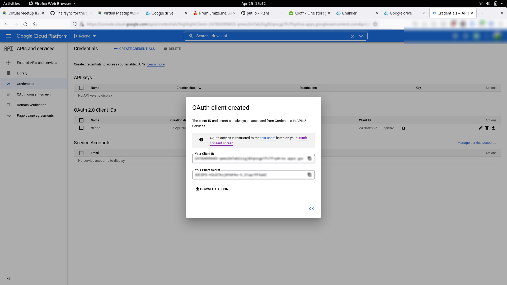
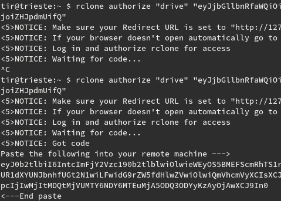
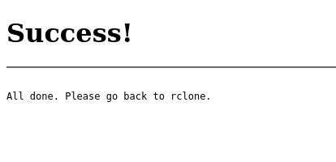
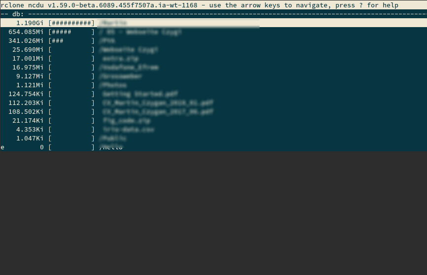
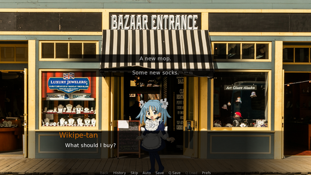
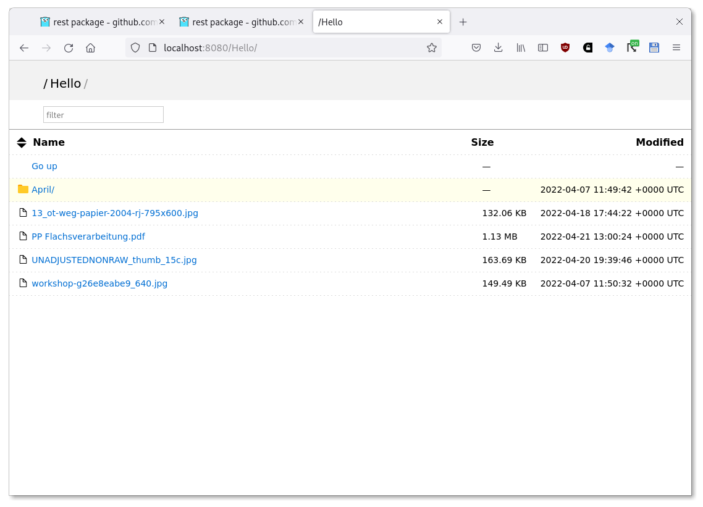
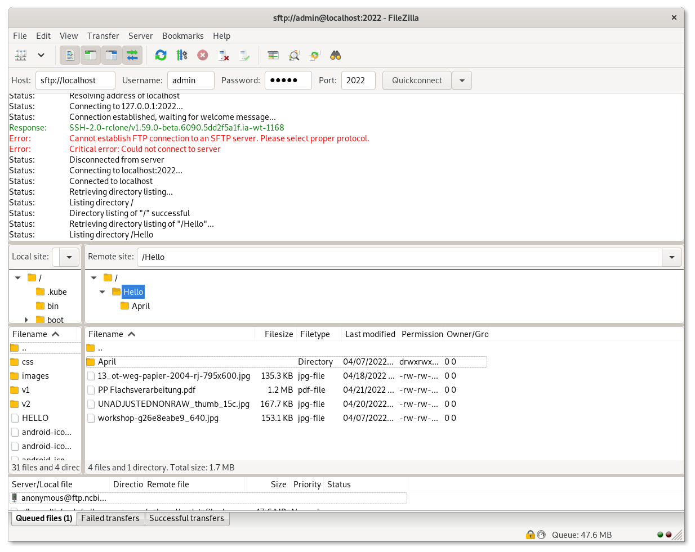

# The rsync for the cloud era: Rclone

> Lightning Talk, [Leipzig Gophers](https://golangleipzig.space) [#26](https://golangleipzig.space/posts/meetup-26-invitation/), 2022-04-26 19:00 CEST

## Things past

> This chapter describes the rsync algorithm, an algorithm for the efficient remote up-
date of data over a high latency, low bandwidth link. -- [Efficient Algorithms for Sorting and
Synchronization](https://maths-people.anu.edu.au/~brent/pd/Tridgell-thesis.pdf) (1999)

A glimpse into how practical software projects originate:

> The rsync algorithm was developed out of my **frustration** with the long time it took
to send changes in a source code tree across a dialup network link. I have spent a
lot of time developing several large software packages during the course of my PhD
and **constantly finding myself waiting** for source files to be transferred through my
modem for archiving, distribution or testing on computers at the other end of the link
or on the other side of the world. **The time taken to transfer the changes gave me
plenty of opportunity to think about better ways of transferring files**.

* So dial up and slow network links
* More on the algorithm: [https://www.cs.tufts.edu/~nr/rsync.html](https://www.cs.tufts.edu/~nr/rsync.html)

An annoyance in the 2010s is the variety of cloud storage providers.

* in [2014](http://web.archive.org/web/20141119184433/http://rclone.org/), rclone supported 6 providers (S3, GCP and GDrive, Dropbox, OpenStack, local)
* in [2022](...), rclone supports over 40 storage systems (e.g. QingStor, Storj, put.io, Koofr, ..., also meta things like Union or Chunker)

But 23 years after rsync, rclone still mentions:

> Transfers over **limited bandwidth**; intermittent connections ...

## Example Usage

Interactive configuration of a remote. Setup remote.



Rclone has a bit unusual interactive config, which comes in handy for copy-and-pasting ids, secrets and tokens.



Finally, temporary rclone server reports: Success.



## Subcommands

* about, help, version, selfupdate
* authorize
* backend
* bisync, sync
* **cat**
* completion
* **config**
* **copy**, copyto, copyurl
* cryptcheck, cryptdecode
* dedupe
* delete, deletefile, purge, cleanup
* genautocomplete
* gendocs
* check, checksum, hashsum, md5sum, sha1sum
* **link**
* **listremotes**
* **ls**, **lsd**, **lsf**, **lsjson**, **lsl**, size
* **mount**
* move, moveto
* **ncdu**, **tree**
* obscure
* rc
* **rcat**
* rcd
* mkdir, rmdir, rmdirs
* **serve**
* settier
* test
* touch

## Example Commands

```shell
$ rclone listremotes
db:
g:
local:
u:
vault:
```

List files:

```
$ rclone ls g:
    41988 Copy of Hello, Colaboratory
     8017 Colab Notebooks/TutorialLabelBinarizer.ipynb
    16168 Colab Notebooks/Copy of synthetic_features_and_outliers.ipynb
    16168 Colab Notebooks/Copy of synthetic_features_and_outliers.ipynb
   463917 Colab Notebooks/Copy of first_steps_with_tensor_flow.ipynb
    44636 Colab Notebooks/Copy of intro_to_pandas.ipynb
    28861 Colab Notebooks/lpugtest.ipynb
    ...
```

Long listing with `lsl`, e.g.

```shell
$ rclone lsl g:
    41988 2017-11-06 18:33:44.791000000 Copy of Hello, Colaboratory
     8017 2018-11-04 14:10:58.713000000 Colab Notebooks/TutorialLabelBinarizer.ipynb
    16168 2018-04-05 23:25:48.889000000 Colab Notebooks/Copy of synthetic_ ...
    16168 2018-04-05 22:44:00.816000000 Colab Notebooks/Copy of synthetic_ ...
   463917 2018-04-05 22:43:01.778000000 Colab Notebooks/Copy of first_step ...
    44636 2018-04-05 20:57:34.492000000 Colab Notebooks/Copy of intro_to_p ...
    28861 2018-01-15 21:46:50.563000000 Colab Notebooks/lpugtest.ipynb
```

Or, conveniently as JSON.

```json
$ rclone lsjson g: | jq .
[
  {
    "Path": "Colab Notebooks",
    "Name": "Colab Notebooks",
    "Size": -1,
    "MimeType": "inode/directory",
    "ModTime": "2018-01-09T18:45:05.497Z",
    "IsDir": true,
    "ID": "100Mz08s0dQGGfHCMyo0fapFyg9oN-gbs"
  },
  {
    "Path": "Copy of Hello, Colaboratory",
    "Name": "Copy of Hello, Colaboratory",
    "Size": 41988,
    "MimeType": "application/vnd.google.colab",
    "ModTime": "2017-11-06T17:33:44.791Z",
    "IsDir": false,
    "ID": "0BxlhQsr_yVQ4SjM0NDJ2dW1TQ3c"
  },
  ...

]
```

Or a [tree](http://mama.indstate.edu/users/ice/tree/) view:

```shell
$ rclone tree g:
/
...
├── CoCo 5_ Ferienwohnungen.ods
├── CoCo 5_ Ferienwohnungen.xlsx
├── Colab Notebooks
│   ├── Copy of first_steps_with_tensor_flow.ipynb
│   ├── Copy of intro_to_pandas.ipynb
│   ├── Copy of synthetic_features_and_outliers.ipynb
│   ├── Copy of synthetic_features_and_outliers.ipynb
│   ├── TutorialLabelBinarizer.ipynb
│   └── lpugtest.ipynb
├── Copy of Hello, Colaboratory
├── Copy of Most Profitable Hollywood Stories.xlsx
...
```

## Mounting a remote

Mount remote as a filesystem, via [Go FUSE implementation](https://bazil.org/fuse/).

> bazil.org/fuse is a Go library for writing filesystems. It is a from-scratch
> implementation of the kernel-userspace communication protocol, and does not
> use the C library from the project called FUSE. bazil.org/fuse embraces Go
> fully for safety and ease of programming.

```shell
$ mkdir ~/g
$ rclone mount g: ~/g
```

## Cross-cloud copy

I only have a few remotes setup currently, but let's copy from dropbox ("db")
to GDrive ("g"), via `copy` subcommand:

```shell
$ rclone copy db:iris-data.csv g:iris-data.csv
```

As rsync, there's a `-P` flag:

```shell
$ rclone copy -P db:iris-data.csv g:iris-data.csv
Transferred:              0 B / 0 B, -, 0 B/s, ETA -
Checks:                 1 / 1, 100%
Elapsed time:         2.1s
```

## Mounting a read-only union

Just to browse across GDrive and dropbox, for example:

```ini
[u]
type = union
upstreams = g:/:ro db:/:ro
```

## Or, ncdu

```shell
$ rclone ncdu db:
```



Fun fact: The author of ncdu also started [vndb](https://en.wikipedia.org/wiki/The_Visual_Novel_Database), a db for [VNs](https://en.wikipedia.org/wiki/Visual_novel) (digital storytelling).



Don't forget: [dust](https://github.com/bootandy/dust), and
[alternatives](https://github.com/bootandy/dust#alternatives); btw,
[ncdu2](https://dev.yorhel.nl/doc/ncdu2) uses [zig](https://ziglang.org/)

## Misc Magic

* autocomplete remote filenames
* create share links in a second

```shell
$ rclone link db:iris-data.csv
https://www.dropbox.com/s/9yr8bze4acjohus/iris-data.csv?dl=0
```

* show quota

```shell
$ rclone about g:
Total:   17 GiB
Used:    480.332 MiB
Free:    2.805 GiB
Trashed: 0 B
Other:   13.726 GiB
```

* pipe to remote

```shell
$ cat README.md | rclone rcat g:/example.md
```

* read a remote markdown file with another [cute Go tool](https://github.com/charmbracelet/glow)

```shell
$ glow -p <(rclone cat g:/example.md)
```

* serve a remote through a web interface

```shell
$ rclone serve http
```



Beside HTTP, there's webdav, sftp, ...




## Plugin Architectures in Go

Go has limited support for hot-loading of Go code, e.g. via
[plugin](https://pkg.go.dev/plugin), and HashiCorp built a system for [plugins
over RPC](https://github.com/hashicorp/go-plugin) (which only appeared in
2016).

Rclone needs backends be in the source tree and compiled into the binary to
work. Not great, not terrible.

```shell
$ tree -d # abridged
.
├── backend
│   ├── alias
│   │   └── test
│   │       └── files
│   │           ├── four
│   │           │   └── five
│   │           └── three
│   ├── all
│   ├── amazonclouddrive
│   ├── azureblob
│   ├── b2
│   │   └── api
│   ├── box
│   │   └── api
│   ├── cache
│   ├── chunker
│   ├── compress
│   ├── crypt
│   │   └── pkcs7
│   ├── drive
│   │   └── test
│   │       └── files
│   ├── dropbox
│   │   └── dbhash
│   ├── fichier
│   ├── filefabric
│   │   └── api
│   ├── ftp
│   ├── googlecloudstorage
│   ├── googlephotos
│   │   ├── api
│   │   └── testfiles
│   ├── hasher
│   ├── hdfs
│   ├── http
│   │   └── test
│   │       ├── files
│   │       │   ├── four
│   │       │   └── three
│   │       └── index_files
│   ├── hubic
│   ├── jottacloud
│   │   └── api
│   ├── koofr
│   ├── local
│   ├── mailru
│   │   ├── api
│   │   └── mrhash
│   ├── mega
│   ├── memory
│   ├── netstorage
│   ├── onedrive
│   │   ├── api
│   │   └── quickxorhash
│   ├── opendrive
│   ├── pcloud
│   │   └── api
│   ├── premiumizeme
│   │   └── api
│   ├── putio
│   ├── qingstor
│   ├── s3
│   ├── seafile
│   │   └── api
│   ├── sftp
│   ├── sharefile
│   │   └── api
│   ├── sia
│   │   └── api
│   ├── storj
│   ├── sugarsync
│   │   └── api
│   ├── swift
│   ├── union
│   │   ├── policy
│   │   └── upstream
│   ├── uptobox
│   │   └── api
│   ├── vault
│   │   └── attic
│   ├── webdav
│   │   ├── api
│   │   └── odrvcookie
│   ├── yandex
│   │   └── api
│   └── zoho
│       └── api
├── bin
├── cmd
├── cmdtest
├── contrib
├── docs
├── fs
├── fstest
├── graphics
├── lib
├── librclone
└── vfs

400 directories
```

## Writing a new backend

Currently, I'm writing an Rclone backend for a digital preservation system
(DPS). The DPS provides an API and we can map a directory structure to a set of
API calls to present a filesystem like interface.

## Interface architecture

Color by numbers, filling out interfaces for filesystem, basic operations like
listing and uploading data, objects and directories.

```
Fs
  Info
    Name() string
    Root() string
    String() string
    Precision() time.Duration
    Hashes ...
    Features() ...
  List
  NewObject(..., remote string) (Object, error)
  Put(..., in io.Reader, src ObjectInfo, options ...OpenOptions) (Object, error)
  Mkdir(..., dir string) ...
  Rmdir(..., dir string) ...

Object
  ObjectInfo
    DirEntry
      String() string
      Remote() string
      ModTime() ...
      Size() ...
    Fs() Info
    Hash(...)
    Storable() bool
  SetModTime(...) ...
  Open(...) ...
  Update(...)...
  Remove(...) ...

Directory
  DirEntry
    String() string
    Remote() string
    ModTime() ...
    Size() ...
 Items() int64
 ID() string

FullObject
  Object
  MimeTypes
  IDer
  ObjectUnWrapper
  GetTierer
  SetTierer
```

## Helpers: REST

Most providers will use some sort of HTTP API and rclone provides support for
that in a [rest](https://pkg.go.dev/github.com/rclone/rclone/lib/rest)
subpackage.

* session handling
* request options, [rest.Opts](https://pkg.go.dev/github.com/rclone/rclone/lib/rest#Opts)
* marshalling and unmarshalling on the fly

Example for [CallJSON](https://pkg.go.dev/github.com/rclone/rclone/lib/rest#Client.CallJSON):

```go
opts := &rest.Opts{
    Method:     "GET",
    Path:       "/users/",
    Parameters: vs,
}
var doc UserList
resp, err := api.srv.CallJSON(context.Background(), opts, nil, &doc)
if err != nil {
    return nil, err
}
defer resp.Body.Close()
```


## Helpers: Config

A new FS can be registered in an `init` function, specifies options to be
passed from the command line.

```go
func init() {
    fs.Register(&fs.RegInfo{
        Name:        "vault",
        Description: "Internet Archive Vault Digital Preservation System",
        NewFs:       NewFs,
        Options: []fs.Option{
            {
                Name:    "username",
                Help:    "vault username (needs to belong to an organization to be usable)",
                Default: "",
            },
            {
                Name:    "url",
                Help:    "vault API URL",
                Default: "http://localhost:8000/api",
            },
            {
                Name:    "debug",
                Help:    "increase output for debugging",
                Default: false,
            },
        },
    })
}
```

Also, there is one config file under `~/.config/rclone/rclone.conf` which contains configured remotes:

```ini
[vault]
type = vault
username = admin
password = admin
endpoint = http://localhost:8000/api

[local]
type = local

[g]
type = drive
client_id = 247830 ....
client_secret = GOCX ...
scope = drive
token = {"access_token":" ...
team_drive =

[db]
type = dropbox
token = {"access_token":" ...

[u]
type = union
upstreams = g:/:ro db:/:ro
```

There is a `NewFs` contructor, which is a function type:

```go
// RegInfo provides information about a filesystem
type RegInfo struct {
    ...
    NewFs func(ctx context.Context, name string, root string,
        config configmap.Mapper) (Fs, error) `json:"-"`
    ...
}
```

And configmapper helps to move data from a flags or config (ini) file into a struct.

```go
func NewFs(ctx context.Context, name, root string, cm configmap.Mapper) (fs.Fs, error) {
    opts := new(Options)
    err := configstruct.Set(cm, opts)
    if err != nil {
        return nil, err
    }
    if !opts.Debug {
        log.SetOutput(ioutil.Discard)
    }
    api := &Api{
        endpoint: opts.Endpoint,
        username: opts.Username,
        password: opts.Password,
        srv:      rest.NewClient(fshttp.NewClient(ctx)).SetRoot(opts.Endpoint),
    }
    if err := api.Login(); err != nil {
        return nil, err
    }
    return &Fs{
        name: name,
        root: root,
        opt:  *opts,
        api:  api,
    }, nil
}
```

## Challenges

* depending on the backend, you will want caching (like directory entries, etc)
* need to find some sensible mapping, if remote is not just files and folders

## Wrap-Up

Never click through a cloud storage web interface again, run:

```
$ rclone config
```

once for your storage system(s) et voilá!

